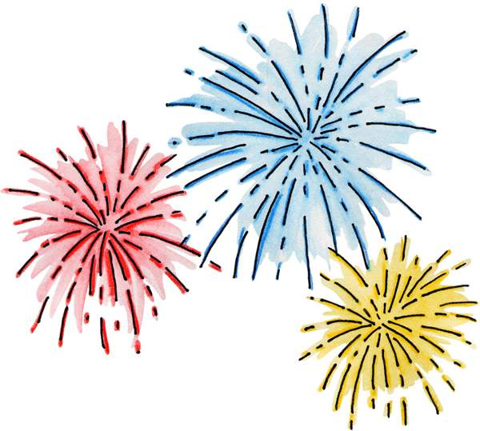

# Certificate of Accomplishment

:::{custom-style="mystyle1"}
<<FIRSTNAME>>  <<LASTNAME>>
:::

has successfully completed the course "Generating Certificates with R" with a score of <<SCORE>>

:::{custom-style="mystyle2"}
Congratulations!
:::

```{r fig2, echo=FALSE, out.width="50%"}

```
